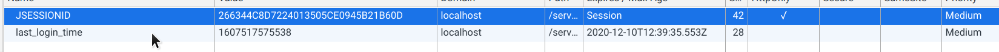

### javaWeb

### 1.基本概念

#### 1.1、javaweb是什么东西

**在java中，动态web资源开发的技术统称为JavaWeb**

 在之前PHP很火的时候，使用PHP作为后端管理的工具、但是现在PHP并不是那么的火了，很多公司不再使用PHP作为后端管理工具，而较多的使用SSM/springboot作为后端管理工具。而在现在的大多数的被广泛使用的程序中，都是交互式页面

#### 1.2、web应用程序

​	**可以提供html访问的程序**

- 任何一个网站中保存的东西都存在于这个世界的一个角落中

- 在web应用程序中，你所有访问到的内容其实都是在一个网页上，不过这个软件会对不同的应用做出不同的适配方案

- 这个web服务器是B/S架构，也就是客户端和服务器之间的架构

  一个web服务器由多个不同的组件所构成

  - html三大件
  - jsp/servlet
  - java程序
  - jar包
  - 配置文件

web程序写完之后，若想i提供给外界使用，是需要一个服务器进行统一的管理的。

#### 1.3、静态web

在静态web中，与用户之间的交互是不会随着用户的变化而变化的

比如每个人访问的baidu页面，都是同一个页面，不会根据不同的用户进行详细的定制化服务

每个人进行一次请求，然后服务器进行一个答回，这个服务器回来的东西就是展现在你的页面上的东西。


无法和数据进行交互

#### 1.4、动态web

web会进行动态展示，每个人看到的页面都是不相同的


缺点：

- 加入服务器的动态资源出现了错误，我们需要重新编写我们的后台程序，重新发布一个网站。

优点：

- web也买你可以进行动态更新，所有的用户看到的都是同一个页面
- 也可以链接数据库，在数据库中进行增加删除
- 成为一个架构师
- 新人注册一个项目之后就可以直接进行更新数据库即可

###  2.web服务器

#### 2.1 技术

ASP（早期微软的web服务器）

- 国内最早流行的服务器
- 在html中嵌入VB脚本，ASP+COM
- 在一个标准页面中，嵌套出其他语言的代码
- 维护服务器的成本非常高

PHP

- PHP开发的速度很快，功能强大，跨平台，代码很简单
- 无法承载较大的访问量

Jsp

B/S架构

浏览和服务器

- sun公司助推的
- 基于java语言（一些开源的软件都是java写的）
- 可以承载三高所带来的问题

#### 2.2 web服务

就是基于tomcat进行的学习。

在工作多年以后手写tomcat也不是一件难事

所有后面的工作都是基于tomcat进行工作的

（也要多了解一些java中提供的东西）

### 3.tomcat

#### 3.1tomcat的下载

windows在官网进行下载

http://tomcat.apache.org/


在官网下载即可

而linux用户需要在库中进行下载/或者直接在java中进行下载

下载之后进行解压即用

**还是可以对tomcat中的setting文档进行访问**并进行修改


以下针对linux用户

​	由于linux中启动tomcat

#### 3.2 tomcat的使用

```shell
使用工具：SSH Secure Shell
登录Linux系统：IP地址、用户名、端口（默认：22）、密码
进入到tomcat的bin目录
cd /usr/share/tomcat9/bin/
启动tomcat
sh startup.sh或者./startup.sh
关闭tomcat
./shutdown.sh进行关闭
查看Tomcat是否以关闭
ps -ef|grep java
出现以下信息，为已启动：
查看Tomcat进程
执行命令 ps -ef|grep tomcat 你就能找出tomcat占据的进程号，要求tomcat启动了。
```

启动之后从localhost或者127.0.0.1进入tomcat中所保存的网站

tomcat就是一个整合的服务器（整合jsp或者其他全新技术的一个服务器）

```
查看Tomcat进程
执行命令 ps -ef|grep tomcat 你就能找出tomcat占据的进程号，要求tomcat启动了。
```


就在这个8080端口中，port代表端口，protocol代表协议如果长时间没有连接上则就会断开

这里就有我们的访问的端口，其中有name和appBase就是访问的位置

而jsp就是在前端代码中添加一个别的地方的代码

可以更改用户端口，在别的地方进行修改即可，

dns库中存在很多的域名与ip地址所对应的位置，每当我们想要去访问一个域名的时候，是需要通过一个ip地址去访问这个端口号的。

### 4、HTTP

#### 4.1、什么是HTTP

http（超文本传输协议）是一个简单的请求-响应协议，它通常运行在[TCP]//网络协议之上。

- 文本：html，字符串，～
- 超文本：图片，音乐，视频，定位，地图
- 80
- 443

#### 4.2、两个时代

- http1.0
  - 1.0只能获得一个web资源
- http2.0
  - 1.1可以获得多个web资源

#### 4.3、http请求

- 客户端到服务器

百度：

```java
Request URL: https://www.baidu.com/ 请求地址
Request Method: GET 方法
Status Code: 200 OK 状态码
Remote Address: 36.152.44.96:443 就是访问的地址
Referrer Policy: strict-origin-when-cross-origin 协议
```


```
Request URL: https://www.baidu.com/ 请求地址
Request Method: GET 方法
Status Code:200/404就是访问失败（资源不存在）
3××：请求重定向：到别的地方去
5××：服务器代码错误
502：网关错误
Remote Address: 36.152.44.96:443 就是访问的地址
Referrer Policy: strict-origin-when-cross-origin 协议
```

常见面试题：

**当你的浏览器中地址栏输入地址并回车到浏览器输出页面后发生了什么**

就是这个javaweb

#### 4.4、http响应

- 服务器到客户端

```
Bdpagetype: 2    
Bdqid: 0xa23a0e210000a0f0
Cache-Control: private   缓存控制
Connection: keep-alive		保持连接/
Content-Encoding: gzip  
Content-Type: text/html;charset=utf-8
Server: BWS/1.1
Set-Cookie: BDSVRTM=422; path=/
Set-Cookie: BD_HOME=1; path=/
Set-Cookie: H_PS_PSSID=1425_33061_31254_33098_33100_33218_33199; path=/; domain=.baidu.com
Strict-Transport-Security: max-age=172800
Traceid: 1606833246046778317811689671317690294512
Transfer-Encoding: chunked
X-Ua-Compatible: IE=Edge,chrome=1
```

### 5、maven

**我们为什么要学习这个技术**

​	1.在javaweb开发中，需要使用大量的jar包，我们需要手动的导入

​	2.maven可以自动帮助我们导入和配置这个jar包

#### 5.1、项目管理

**maven的核心思想：约定大于配置**

​	maven会规定你去如何去写一个代码

​	maven去linux中下载

​	到官网中进行下载

 就是会有一个地方会自动帮我们导入jar包

#### 5.2、Maven项目架构管理工具

IDEA和maven还有着很多的相关操作，就是在idea和maven之间还存在着不少的关联。

部署tomcat来实现webapps应用，就是在idea中，我们构建一个webapps，可以通过接口化服务器直接在服务器上跑起来


maven的命令行操作，

 

就是maven的插件和相关的依赖就是jar包

pom.xml

```xml
<?xml version="1.0" encoding="UTF-8"?>

<project xmlns="http://maven.apache.org/POM/4.0.0" xmlns:xsi="http://www.w3.org/2001/XMLSchema-instance"
  xsi:schemaLocation="http://maven.apache.org/POM/4.0.0 http://maven.apache.org/xsd/maven-4.0.0.xsd">
  <modelVersion>4.0.0</modelVersion>
<!--就是我们刚刚生成的maven的GAV。-->
  <groupId>org.example</groupId>
  <artifactId>webapp</artifactId>
  <version>1.0-SNAPSHOT</version>
  <packaging>war</packaging>就是表示这是一个javaweb应用

  <name>webapp Maven Webapp</name>
  <!-- FIXME change it to the project's website -->
  <url>http://www.example.com</url>

  <properties>
    <project.build.sourceEncoding>UTF-8</project.build.sourceEncoding>项目构建编码
    <maven.compiler.source>1.7</maven.compiler.source>
    <maven.compiler.target>1.7</maven.compiler.target>
  </properties>编码版本
具体用的jar包依赖
  <dependencies>
    <dependency>
      <groupId>junit</groupId>
      <artifactId>junit</artifactId>
      <version>4.11</version>
      <scope>test</scope>
    </dependency>
  </dependencies>

  <build>
    <finalName>webapp</finalName>
    <pluginManagement><!-- lock down plugins versions to avoid using Maven defaults (may be moved to parent pom) -->
      <plugins>
        <plugin>
          <artifactId>maven-clean-plugin</artifactId>
          <version>3.1.0</version>
        </plugin>
        <!-- see http://maven.apache.org/ref/current/maven-core/default-bindings.html#Plugin_bindings_for_war_packaging -->
        <plugin>
          <artifactId>maven-resources-plugin</artifactId>
          <version>3.0.2</version>
        </plugin>
        <plugin>
          <artifactId>maven-compiler-plugin</artifactId>
          <version>3.8.0</version>
        </plugin>
        <plugin>
          <artifactId>maven-surefire-plugin</artifactId>
          <version>2.22.1</version>
        </plugin>
        <plugin>
          <artifactId>maven-war-plugin</artifactId>
          <version>3.2.2</version>
        </plugin>
        <plugin>
          <artifactId>maven-install-plugin</artifactId>
          <version>2.5.2</version>
        </plugin>
        <plugin>
          <artifactId>maven-deploy-plugin</artifactId>
          <version>2.8.2</version>
        </plugin>
      </plugins>
    </pluginManagement>
  </build>
</project>
就是项目构建用的，使用了一个插件。 
```

maven的约定大于配置，我们之后可能会遇到，我们写的配置文件无法导入

maven资源导出问题，在build中配置resources，来防止我们的资源导出失败的问题。

#### 5.3、IDEA操作

可以使用一个树来实现这个maven依赖的实现方式！！！！


版本问题出现延后，由于idea自动给你生成的版本是有点老化的，所以采用tomcat官方所使用的4,0版本。

整个maven项目就是这样的几个组件，特别需要进行注意。

### 6、Servlet

6.1、Servlet简介

- servlet是sun公司开发动态web的一项技术
- Sun就是在这些api中提供一个接口叫做：servlet，如果开发serlet程序，就是两个步骤：
  - 编写一个类实现servlet
  - 把开发好的java部署到javaweb服务器中。

#### 6.2、helloservlet项目


可以在maven中加入一个子工程

- 父项目中会有一个model

```xml
    <modules>
        <module>servlet-01</module>
    </modules>

```


- 子项目汇总会有

```xml
  <parent>
    <artifactId>javeweb-2.0-helloservelt</artifactId>
    <groupId>com.yili</groupId>
    <version>1.0-SNAPSHOT</version>
  </parent>
```

#### 6.3、maven环境优化

1. 修改xml为最新的
2. 将maven的结构搭建完整

#### 6.4编写一个servlet程序

1. 编写一个普通类
2. 继承httpsever

```java
package com.yili.servlet;

import javax.servlet.ServletException;
import javax.servlet.http.HttpServlet;
import javax.servlet.http.HttpServletRequest;
import javax.servlet.http.HttpServletResponse;
import java.io.IOException;
import java.io.PrintWriter;

public class HelloServlet extends HttpServlet {
    @Override
    protected void doGet(HttpServletRequest req, HttpServletResponse resp) throws ServletException, IOException {
        PrintWriter writer = resp.getWriter();//stream;
        writer.print("Hello,Servlet");
    }

    @Override
    protected void doPost(HttpServletRequest req, HttpServletResponse resp) throws ServletException, IOException {
        super.doPost(req, resp);
    }
}
//我们所重写的这两个类可以进行互相实现
```

#### 6.5编写servlet的映射

```xml
<web-app>
  <servlet>
    <servlet-name>hello</servlet-name>
    <servlet-class>com.yili.servlet.HelloServlet</servlet-class>
  </servlet>
    不同情况下的映射
  <servlet-mapping>
    <servlet-name>hello</servlet-name>
    <url-pattern>/hello</url-pattern>
  </servlet-mapping>
</web-app>
```

#### 6.6 配置tomcat中的路径

#### 6.7 点亮

#### 6.8、servlet原理


#### 6.9、servletContext

servlet在本质上是一种全局的储存信息的空间，服务器打开时就存在，服务器关闭时进行释放。


我们可以把ServletContext当成一个公用的空间，可以被所有的客户访问，如上图，A、B、C三个客户端都可以访问。

WEB容器在启动时，它会为每个Web应用程序都创建一个对应的**ServletContext**，它代表当前Web应用，并且它被所有客户端共享。

由于是共享的，所以多个servlet可以通过这个servlet进行共享数据。大满贯web应用进行关闭、tomcat关闭、web应用reload时，servletcontext对象会被销毁。

1. 获取一个ServletContext对象：

   this.getServletContext();  

   this.getServletConfig().getServletContext();

2. 其实这个对象就是一个可以存储键值对的一个map（可能会更复杂，但是我对这个的原理还是有点生疏。

   **添加属性：setAttribute(String name, Object obj);**

   **得到值：getAttribute(String name)，这个方法返回Object**

   **删除属性：removeAttribute(String name)**

3. 生命周期：

   从服务器被创建开始，到服务器关闭时结束。

#### 6.10 servletContext的应用

###### 1、多个Servlet可以通过ServletContext对象来实现数据间的共享

类似于Session，通过ServletContext对象我们也可以实现数据共享，但值得注意的是，Session是只能在一个客户端中共享数据，而ServletContext中的数据是在所有客户端中都可以实现数据共享的。

###### 2、实现servlet的转发请求：

请求转发，就是服务器的行为，将这个服务器转发给另一个页面进行处理。如何转发，转发几次，客户端是不知道的。也就是将request在不同的也页面之间进行传递。请求转发实际上就是一个servlet中调用其他的servelt。

1. \> 客户端浏览器发送一次请求,剩下的由服务器进行处理
2. \> 地址栏不会改变,**存在RRL中的数据重复提交的风险,容易造成安全问题**
3. \> 参数可以一直传递,**参与的servlet共享request和response**
4. \> 只能跳转到内部资源(项目中), 不能跳转外部资源(项目外)
5. \> 可以访问受保护的资源(WEB-INF)

```java
req.getRequestDispatcher("WEB-INF/test.html").forward(req, resp);//经过req进行调用并进行实现
this.getServletContext().getRequestDispatcher("/gp").forward(req,resp);//经过ServletContext进行传递！！！
```


###### 3.properties资源导出问题：

由于在maven中存在约定大于配置的情况，所以在将maven项目作为javaweb项目进行运用时

一般针对java中的properties文件和xml文件在默认情况下进行导入：

```xml
  <build>
    <resources>
      <resource>
        <directory>src/main/resources</directory>
        <includes>
          <include>**/*.properties</include>
          <include>**/*.xml</include>
        </includes>
        <filtering>true</filtering>
      </resource>
      <resource>
        <directory>src/main/java</directory>
        <includes>
          <include>**/*.properties</include>
          <include>**/*.xml</include>
        </includes>
        <filtering>true</filtering>
      </resource>
    </resources>
  </build>
  
  
```

也就是说javaweb项目通过maven生成一个war包  

读取pro资源文件：

```java
protected void doGet(HttpServletRequest req, HttpServletResponse resp) throws ServletException, IOException {
        InputStream inputStream =
                this.getServletContext().
                        getResourceAsStream("/WEB-INF/classes/db.properties");
        Properties properties = new Properties();
        properties.load(inputStream);
        String user = properties.getProperty("username");
        String pwd = properties.getProperty("password");
        resp.getWriter().println(user+":"+pwd);
    }
```

思路：需要一个文件流！！！

#### 6.11 HttpServletResponce

web收到客户端的http请求，分别创建一个代表请求的HttpServletresquest对象

- 获取客户端请求过来的参数：resquest

- 给客户端响应信息：responce

  

###### 1.简单分类

负责向浏览器发送数据的方法：

```java
ServletOutputStream getOutputStream() throws IOException;
PrintWriter getWriter() throws IOException;
```

一个是PrintWriter

另一个是ServletOutputStream

###### 2.常见应用：

1.向浏览器输出消息

就是getwriter和outputstream：

2.下载文件：

	1. 下载文件的路径
	2. 下载的文件名是什么
	3. 让浏览器能够支持下载我们需要的东西
	4. 获取下载文件的输入流
	5. 获取缓冲区
	6. 获取Outputstream
	7. 将file写入到buffer缓冲区
	8. 使用Output将缓存区文件发送出去。

3,下载文件问题：

```java
protected void doGet(HttpServletRequest req, HttpServletResponse resp) throws ServletException, IOException {
        String context = "/WEB-INF/classes/ont.png";
    //设置相对路径
        ServletContext sc = this.getServletContext();
        String realpath =  sc.getRealPath("/");
        System.out.println("root:"+realpath);
	//设置要进行下载的文件名
        String filename = context.substring(context.lastIndexOf("/")+1);


        InputStream inputStream = sc.getResourceAsStream(context);
		//读取文件流操作
        resp.setHeader("Content-Type", "application/octet-stream");
        resp.setHeader("Content-Disposition", "attachment;filename="+ URLEncoder.encode(filename,"UTF-8"));
		//设置这个的响应头操作
        int len = 0;
        byte[] buffer = new byte[1024];
        ServletOutputStream servletOutputStream = resp.getOutputStream();
        while ((len=inputStream.read(buffer))>0){
            servletOutputStream.write(buffer,0,len);
        }//文件流的写入操作！！
        inputStream.close();
        servletOutputStream.close();
    	//关闭这俩文件流
```

4.验证码功能：

- 前端实现
- 后端实现，需要生成图片

```java
protected void doGet(HttpServletRequest req, HttpServletResponse resp) throws ServletException, IOException {
        resp.setHeader("refresh","3");
        //refresh
        BufferedImage bufferedImage = new BufferedImage(50,20,BufferedImage.TYPE_INT_BGR);
        Graphics2D graphics2D = (Graphics2D) bufferedImage.getGraphics();
        graphics2D.setBackground(Color.BLUE);
        graphics2D.fillRect(0,0,50,20);
        graphics2D.setColor(Color.ORANGE);
        graphics2D.setFont(new Font(null,Font.BOLD,20));
        graphics2D.drawString(makenum(),0,20);
		//绘图的类
        resp.setContentType("image/jpeg");
        resp.setDateHeader("expires",-1);
        resp.setHeader("Cache-Control","no-cache");
        resp.setHeader("Pragma","no-cache");
		//返回给浏览器的头操作
        ImageIO.write(bufferedImage,"jpg",resp.getOutputStream());
    	//在浏览器中画图
    }

    private String makenum(){
        Random random = new Random();
        String num =  random.nextInt(9999)+"";
        StringBuilder stringBuffer = new StringBuilder();
        for (int i = 0; i < 4-num.length(); i++) {
            stringBuffer.append("0");
        }
        num = stringBuffer.toString() + num;
        return num;
    }
```


4.实现重定向

常见场景：用户登录之后发现没有登录，跳到登录页面，如果已经登录了，就返回你要进行操作的页面。

就一行代码就可以进行重定向！！

```java
resp.sendRedirect("/servlet_03_war/image");
```

就是使用resp中的send方法进行使用，直接进行重定向操作即可！！

而实现jsp操作中进行前端重定向到后端操作时，是会进行很多别的操作的！！！

#### 6.12 HttpServletRequest

这个代表客户端的请求，表示可以通过req调用客户端的方法！

### 7.Cookie和Session

#### 7.1、会话

**会话**：用户打开一个浏览器，点击了很多超链接，访问多个web资源，关闭浏览器，这个过程叫做会话。

**有状态会话**：

你能怎么证明你是哪个学校的学生？

对象：你        学校

1. 发票    学校给你发票
2. 学校登记        学校标记你来过了

一个网站怎么证明你来过？

客户端     服务端

1. 客户端给服务端一个信件，下次访问的时候带上信件就可以了;cookie
2. 服务器登记你来过了，下次你来的时候我来匹配你

#### 7.2、保存会话的两种技术

**cookie**

- 客户端请求（响应、请求）

**session**

- 服务器技术，利用这个技术，客户端保存你的信息，下次再来的时候就直接进来就行

应用：就是你登录之后下次就不需要进行登录了！！

```java
protected void doGet(HttpServletRequest req, HttpServletResponse resp) throws ServletException, IOException {
        req.setCharacterEncoding("utf-8");
        resp.setCharacterEncoding("utf-8");

        PrintWriter out = resp.getWriter();

        Cookie[] cookies = req.getCookies();
        if(cookies!=null){
            out.write("last_time_login:");
            for (Cookie cookie : cookies) {
                if(cookie.getName().equals("last_login_time")){
                    long l = Long.parseLong(cookie.getValue());
                    Date date = new Date(l);
                    SimpleDateFormat format = new SimpleDateFormat("yyyy-MM-dd HH:mm:ss");
                    out.write(format.format(date));
                }
            }
        }else out.write("it is your first login");

        Cookie cookie = new Cookie("last_login_time",System.currentTimeMillis()+"");
        resp.addCookie(cookie);
    }
```

就是应用cookies，在返回给客户端时，让他得到一个cookies，这个cookies保存着上次访问的信息流，在下次访问这个网站的时候就可以进行不登录的操作！！


这个就是resp返回给浏览器的东西！！


从请求中拿到cookies，再到浏览器中返回cookies


**一个网站的cookies是否存在上限？**

- 一个cookie只能保存一个信息
- 一个web站点可以给浏览器发送多个cookies，最多存放20个cookie：
- cookie大小有限制为4kB
- 300个cookie浏览器上限


删除cookie：

- 不设置有效期，关闭浏览器，自动失效
- 设置有效时间为0

编码和解码的问题，就是在java中上传一个变量时，可能会导致编码出现问题！！

```java
URLEncoder.encode("","utf-8");
URLDecoder.decode("","utf-8");
```

#### 7.4、session

什么是session：

- 服务器会给每一个用户创建一个session对象;
- 一个session独占一个浏览器，只要浏览器没有关闭，这个session就存在



这个cookies里面保存的就是session的id

```java
req.setCharacterEncoding("utf-8");
resp.setCharacterEncoding("utf-8");
resp.setContentType("text/html;character=utf-8");

HttpSession session = req.getSession();
session.setAttribute("name","yili");

String sessionId = session.getId();

if(session.isNew()){
	resp.getWriter().write("success!!!!");
	}else {
		resp.getWriter().write("ID"+sessionId);
		resp.getWriter().write(session.getAttribute("name")+"");
	}

}
```

这个是新建一个session，在这个服务器的session中添加一个session的文件

下面是读取这个session中的元素

```java
req.setCharacterEncoding("utf-8");
resp.setCharacterEncoding("utf-8");
resp.setContentType("text/html;character=utf-8");

HttpSession session = req.getSession();
String name = session.getAttribute("name").toString();

resp.getWriter().write(name);
```


手动使session失效


Session和cookie的区别：

- cookie是把用户的数据写给用户的浏览器，浏览器保存（可以保存多个）
- session吧用户的数据写到用户独占的session中，服务器保存（保存重要的信息）
- session对象由服务器进行创建


使用场景：

- 保存一个登录用户的信息
- 购物车信息
- 在整个网站经常会使用的信息


使用一个session：

```java
req.setCharacterEncoding("utf-8");
resp.setCharacterEncoding("utf-8");
resp.setContentType("text/html;character=utf-8");

HttpSession session = req.getSession();
session.setAttribute("name","yili");

String sessionId = session.getId();

if(session.isNew()){
resp.getWriter().write("success!!!!");
}else {
resp.getWriter().write("ID"+sessionId);
resp.getWriter().write(session.getAttribute("name")+"");
}
```

就是

```java
public void setAttribute(String name, Object value);
public Object getAttribute(String name);
public void removeAttribute(String name);
```

手动注销session：

```java
public void invalidate();
```

就是直接注销你的session，在下次登录时会自动生成！！！

session自动注销：

```xml
<session-config>
        <session-timeout>1440</session-timeout>
</session-config>
```


**/home/yili/.cache/JetBrains/Intell iJIdea2020.2/tomcat/Unnamed_javeweb-2_0-helloservelt_2/**

### 8、JSP

#### 8.1、jsp是什么

jsp本质上就是一个servlet，通过将jsp转化为一个class进行转换成为一个servlet


#### 8.2、JSP的本质

```java
    final javax.servlet.jsp.PageContext pageContext;
    javax.servlet.http.HttpSession session = null;
    final javax.servlet.ServletContext application;
    final javax.servlet.ServletConfig config;
    javax.servlet.jsp.JspWriter out = null;
    final java.lang.Object page = this;
```

#### 8.3、jsp语法

脚本程序可以包含任意量的Java语句、变量、方法或者表达式，只要它们在脚本语言中是有效的。

##### jsp脚本插入

```jsp
<%
    pageContext.setAttribute("name1","a");
    request.setAttribute("name2","b");
    session.setAttribute("name3","c");
    application.setAttribute("name4","d");
%>

<%
    Object name1 = pageContext.getAttribute("name1");
    Object name2 = pageContext.getAttribute("name2");
    Object name3 = pageContext.getAttribute("name3");
    Object name4 = pageContext.getAttribute("name4");
%>
```

##### jsp声明

一个声明语句可以声明一个或者多个变量、方法，给后面的java代码进行使用。先声明这些变量和方法，然后进行使用。

```jsp
<%!
    int a,b,c;
    Date date =new Date();
%>
<%
    a=b=c=1;
    out.println(a+b+c);
    out.println(date);
%>
```

##### jsp表达式

表达式就是将你写入的一行表达式转化为一个String，再通过out进行输出出来！

```jsp
<p>
    Today's date:<%= date.toLocaleString()%>
</p>
```

#### 8.4、JSP指令

jsp指令用来设置与整个JSP页面相关的属性。

jsp指令语法格式：

```jsp
<%@ page contentType="text/html;charset=UTF-8" language="java" %>
<%@page isErrorPage="true" %>
<%@page autoFlush="true" %>
<%@page extends="java.lang.String" %>
<%@page import="java.lang.*" %>
```

在页面的最开始设置page页面

```jsp
<%@include file="../index.jsp"%>
<jsp:include page="../index.jsp"/>
```

#### 8.5、JSP动作元素

这些动作元素是利用xml的语法进行完成的。利用动作元素可以动态地插入文件，重用JavaBean组件、把用户重定向到另外的页面、为java插件生成html代码

动作元素只有一种语法，就是之前在jsp中书写include语法中的代码！


常见的属性：

所有的动作元素都有两个属性：id和scope属性

- id属性：

  id属性是动作元素的唯一标识，可以在在jsp页面中引用。动作元素创建的id值可以通过PageContext来进行调用。

- scope属性：

  该属性用于识别动作元素的生命周期。 id属性和scope属性有直接关系，scope属性定义了相关联id对象的寿命。 scope属性有四个可能的值： (a) page, (b)request, (c)session, 和 (d) application。

，

#### 8.7、JSP九大隐式对象


隐式对象：

是jsp容器为每个页面提供的Java对象，当你想使用这些对象时，就不用再自己进行实现。直接调用系统为你提供的实现类（即隐式对象）即可！

**request对象**

```jsp
<%
    Enumeration<String> headerNames = request.getHeaderNames();
    while (headerNames.hasMoreElements()){
        String paramName = headerNames.nextElement();
        String header = request.getHeader(paramName);
        out.println("<h2>"+paramName+":"+header+"</h2>");
    }
%>
```

下面是通过访问web的信息得到的header，和上述程序获得的信息完全相同，不过上面的信息并没有进行排序


